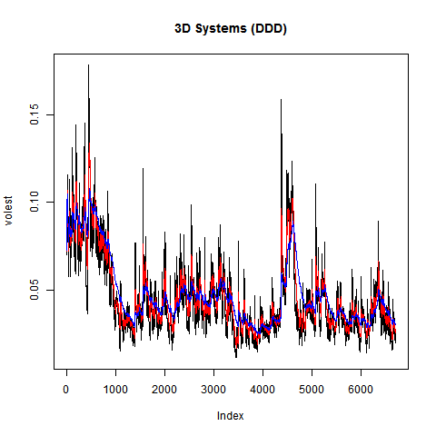

## Load Data 
```{r}
source("HW 11 Calculations.R")
```

## Volatility Graph
```{r}
volest <- Vol(10,DDDret)

volest2 <- Vol(30,DDDret)

volest3 <- Vol(100,DDDret)

png("voldDDD.png")
volplot <- plot(volest,type="l", main="3D Systems (DDD)")

lines(volest2,type="l",col="red")

lines(volest3, type = "l", col="blue")
dev.off()
```


